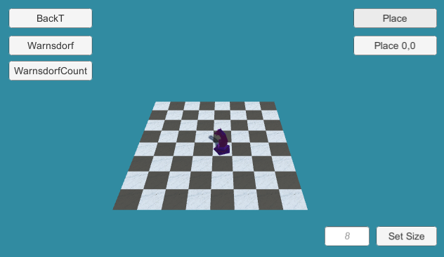

# Unity Knight's Tour

A knight's tour is a sequence of moves of a knight on a chessboard such that the knight visits every square only once.

This project uses Unity's Coroutines to implement Knight's Tour Warnsdorf's solution.

## BackTracking
* O (8^(n^2))

## Warnsdorf
* ϴ (n^2)